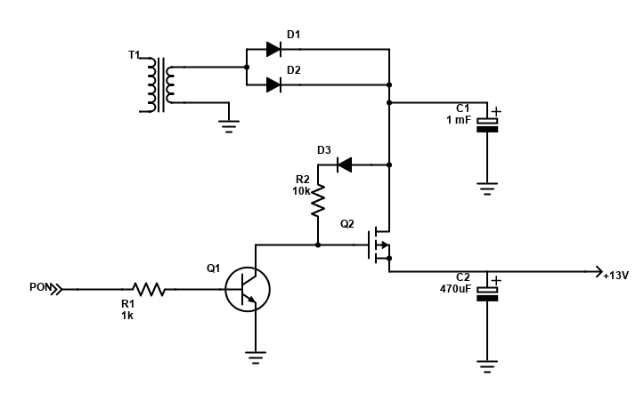

# Foam Cutter

Build plans for a hot wire foam cutter similar to Proxxon Micromot 230/E built from a broken Samsung BD-P1500 blue-ray player, an arduino nano clone, an old bicycle wheel, some wood etc...

## Idea

A home built foam cutter using the same kind of 0.2 mm NiCr 8020 wire used by the Proxxon. Similar but better and unique...

## Parts

The only things I use from the blue-ray player is the case, power led, buttons and the power supply.

### Case

The blue-ray player case is the wire cutter case.
To make a working surface which is flat and has T-tracks to fasten fence etc,
there could be a 12-16 mm MDF board with a 3-4 mm HDF board on top of it. The T-tracks are built from a narrow slot in the thing HDF board with a wider slot in the MDF below it

    ==== ==== HDF board
    ###   ###
    ###   ### MDF board
    ###   ###
    --------- BD steel case

Inside the case, the power supply section should be well isolated from moving or accessible parts.

#### Lower wire connection.

It should be convenient to change wire without opening the entire case. One option is to make a hole in the bottom of the case, under the wire. The lower end of the wire should be electrically connected to the ground, and the case is connected to signal ground, so having the wire go through a metal hole in the case should be electrically unproblematic. The issue might be the thin metal wire and tear against some sharp edge.

One option could be to have some metal thingie with an electrical wire properly connected to the chassis, and a hole where the NiCr wire is locked with a screw. Then a spiral spring might be placed on the NiCr wire top of the thingie before it's pulle through the hole in the chassis. Maybe it's enough to have a spring up by the bow.

#### T-track

Two parallel slots in the metal lid will enable movement of attachments back and forth between positions closer to the bow or closer to the wire. Directly under the slots, covering it with margin and reaching the bottom of the case for stability, there should be wooden supports with groves directly under the slots (but wider) which house small wooden blocks that can slide in the grove under the slot, with a bolt protruding through the slot. Fences etc can be attached to the bolts and fastened with wing nots or knobs.

Question: Would Proxxon compatible T-track be a good thing?

### Bow

The upper end of the cutting wire will be held by a quarter of a bicycle wheel, approximately 300 mm inside radius, giving us the same maximum cutting distance and the same length of the wire regardless of cutting angle, 0-90 degrees.
Maybe connect wire to bow with a piece of wood which fits around the aluminium profile.

### Power Supply

The power supply has an always present AL5V output and a PON input which enables the other voltage outputs when +5V is applied to it. I haven't been able to find a maximum rated current for the +13V I intend to use, but I hope it will suffice.

The power control works like this: 

I hope that I will get a fairly stable and controlled output voltage by controlling PON with PWM output from the arduino.

### Pedal

Two pieces of plywood connected with a hinge, with a micro switch, a spring and a stop block between. A two-wire cable.

## Operation

When active, the +13V will be used to feed current to the NiCr cutting wire. The arduino will use a PWN output to feed the PON signal to provide appropriate power to the wire.

The idea is to power the arduino with AL5V, and provide the following from it.

  - Pressing the power button will toggle the arduino program between idle and operational.
  - Pressing |< or >| will decrease or increase the settings for wire temperature, with the least being TBD and the most corresponding to a 1 A current. The setting should be indicated somehow... Visual or sound?
  - Pressing a foot pedal will turn on the power to heat the wire, based on the |< / >| setting. I.e. it will shift the state between waiting and active. There should probably be a visual cue too.

The settings should provide an even interval of cutting powers between the lowest meaningful value and the highest value which is useful and doesn't overload anything. In between these limits, the settings should vary the PWM ratio / voltage so that the power intervals, which are proportional to the voltages squared, are even. Wire resistance for 30 cm was measured to 13 Ohms, suggesting that the upper limit will be 100% PWM ratio.

